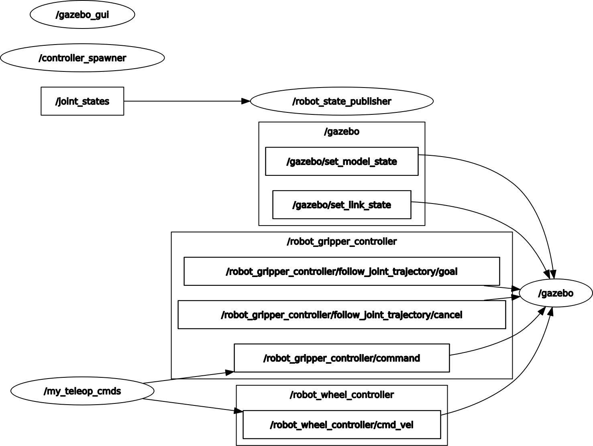
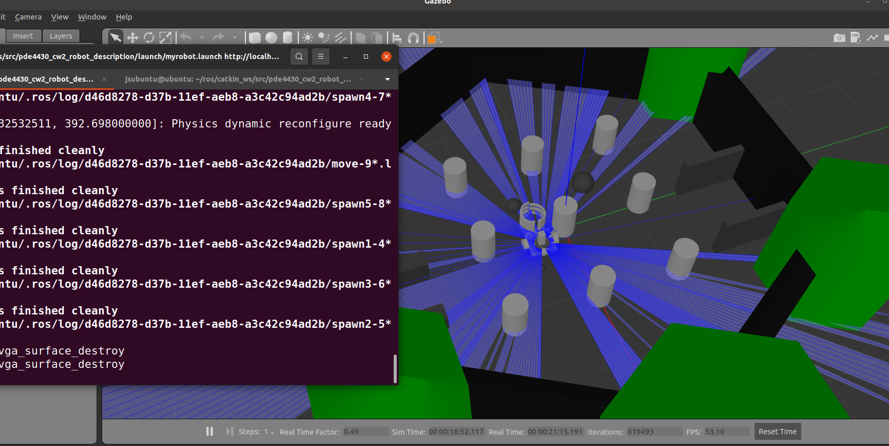

# PDE4430 Coursework-02 _ Robot Creation and achive the task (Middlesex University)


## 1. <u>Task</u>
As per the task, we are instructed to design a robot to move around the area (world) and there will be three size of spres around the area. Robot need to bring these spres to the special goal. Robot can design any determinded desin and there is no any specific standard to design the robot.

## 2. <u>Planning</u>
As per the coursework, i have being to develop a robot that can move towards the spheres in the area (world) and need to bring all of them to the designated place (to the Goal). In this case robot should be able to move and there should be a related gripping mechanism to catch spheres. 

## 3. <u>Robot Creation</u>
For create the robot, I used Solid works 2021 and exported as a URDF file using a Solid work export plugin tool.

**First Demostration in Rviz** can be view via below link;
[](https://www.youtube.com/watch?v=gdx-bQXcAog)

## 4. <u>Move the Robot</u>
Robot can be move using keyboard control (`W`,`A`,`S`,`D`) and gripper also can be control using keyboard (`0 - Open Gripper`, `1 - Close gripper for bigger sphere`, `2 - Close gripper for medium size sphere`, etc).

## 5. <u>How to establish the project</u>
For establish the project need to have ROS1, Gazebo installed.
- For install ROS;
https://wiki.ros.org/ROS/Installation

- For install Gazebo
```
sudo apt install gazebo11 libgazebo11-dev
```
```
sudo apt install ros-noetic-gazebo-ros-pkgs ros-noetic-gazebo-ros-control
```

- For install Rviz
```
sudo apt install ros-noetic-rviz
```

- For Install Necessary ROS Packages
```
sudo apt install ros-noetic-ros-control ros-noetic-ros-controllers
```

- For Install Navigation Stack (for autonomous navigation)
```
sudo apt install ros-noetic-navigation
```

- For Install Robot State Publisher (for robot model and joint state)
```
sudo apt install ros-noetic-robot-state-publisher
```

- For Install Teleoperation (keyboard control for robot):
```
sudo apt install ros-noetic-teleop-twist-keyboard
```

- For ROS packages to be clone. Once cloned, need to built the workspace
```
git clone https://github.com/ros-simulation/gazebo_ros_pkgs.git
```


## 6. <u>Run the program</u>
Need to run the launch file using below command;
`roslaunch pde443_cw2_robot_description myrobot.launch`. 
World, robot and all the controllers will be start with this. It will open in Gazebo envorinment.

## 7. <u>RQT Graph</u>
We can see the rqt graph using below command;
`rosrun rqt_graph`.

Below is the RQT Graph of this process.



## 8. Rostopic list and Rosnode list as per the development
- <u>RosTopics</u>
```
/clock
/gazebo/link_states
/gazebo/model_states
/gazebo/parameter_descriptions
/gazebo/parameter_updates
/gazebo/performance_metrics
/gazebo/set_link_state
/gazebo/set_model_state
/joint_states
/robot_gripper_controller/command
/robot_gripper_controller/follow_joint_trajectory/cancel
/robot_gripper_controller/follow_joint_trajectory/feedback
/robot_gripper_controller/follow_joint_trajectory/goal
/robot_gripper_controller/follow_joint_trajectory/result
/robot_gripper_controller/follow_joint_trajectory/status
/robot_gripper_controller/state
/robot_wheel_controller/cmd_vel
/robot_wheel_controller/odom
/robot_wheel_controller/parameter_descriptions
/robot_wheel_controller/parameter_updates
/rosout
/rosout_agg
/scan
/statistics
/tf
/tf_static
```

- <u>RosNodes</u>
```
/controller_spawner
/gazebo
/gazebo_gui
/my_teleop_cmds
/robot_state_publisher
/rosout
/rqt_gui_py_node_25111
```


## 9. <u>Demostration Video</u>
Demostration can be watch in below link.

[]([video.mp4](https://www.youtube.com/watch?v=K_syE_s7-hU))

## 10. <u>Further more...</u>
Program under development for mapping and automation the process with sensors (Lidar) `myrobot.launch` ,`robot_mapping.launch`, SLAM and Rviz.

